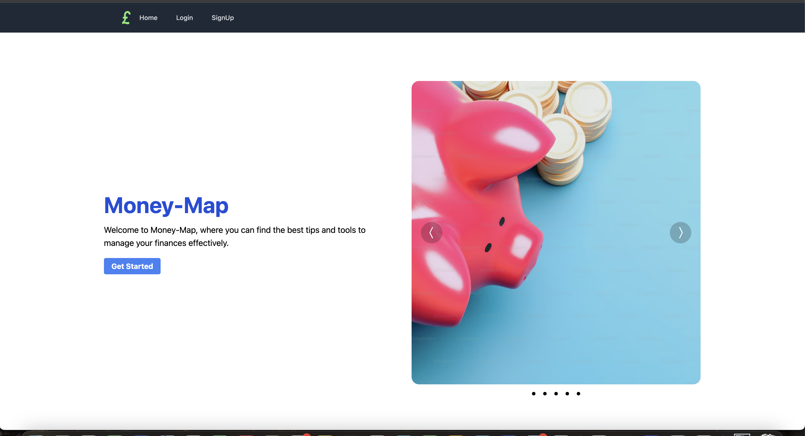
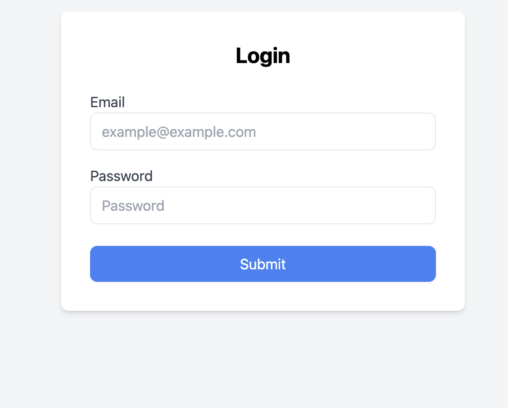
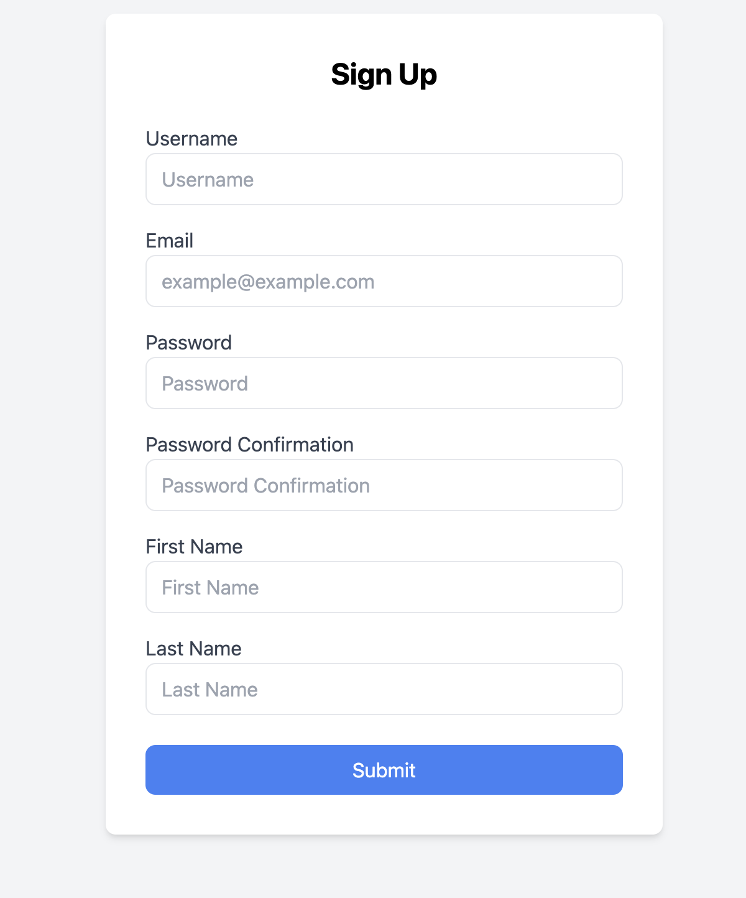
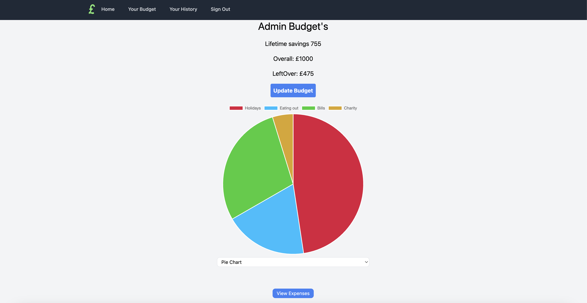
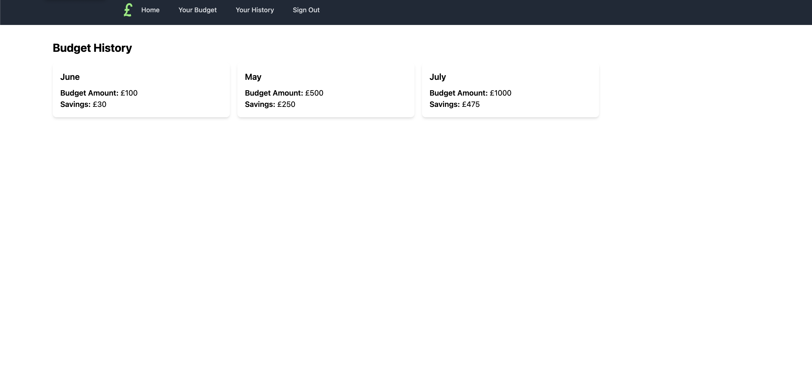
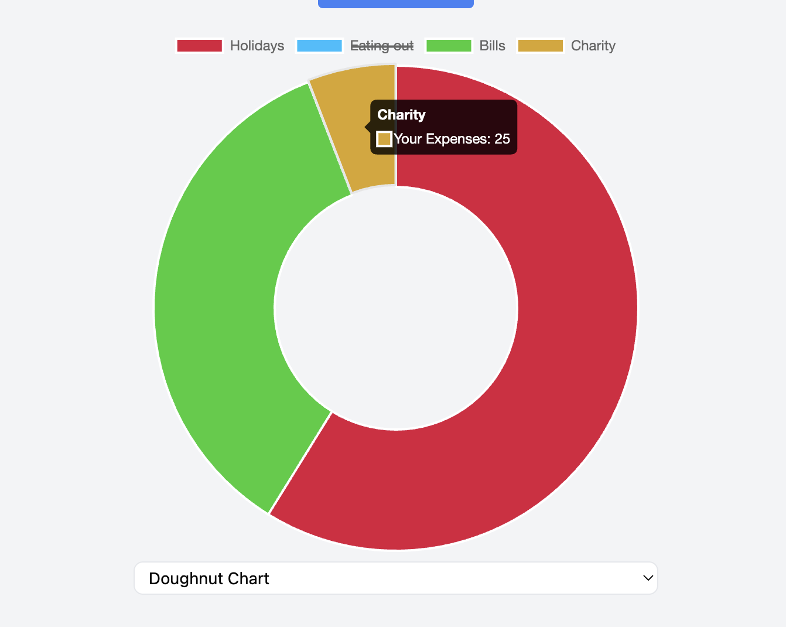

# Money Map

A full-stack project completed individually within a one-week deadline.



## Description

Money Map is a budgeting app designed to help you manage your finances effectively. With Money Map, you can create monthly budgets and track your expenses with full CRUD (Create, Read, Update, Delete) functionality. This application allows you to monitor your spending habits, ensuring that you stay within your budget and make informed financial decisions. I built this app to provide an easy-to-use and comprehensive tool for personal financial management. This was built during my time at General Assembly for my fourth project.


## Getting Started
You can access the deployed app [here](https://money-map-ga-project.netlify.app/). For detailed planning and development information, refer to my [planning materials](https://trello.com/b/GZpeAlXF/project-4-budgeting-app-board).

## Brief ##
* Build a full-stack application - by making your own backend and your own front-end.
* Create a Python Django Backend 
* Consume your API with a separate front-end built with React.
* Ensure there is CRUD functionality. 
* Implement thoughtful user stories/wireframes that are significant enough to help you know which features are core MVP and which you can cut.
* Have a visually impressive design.
* Be deployed online so it's publicly accessible.

## Built With ##
* Frontend
  * React.js
  * JSX
  * CSS 
  * TailWind
  * Axios
  * React-Router-Dom
  * React-toastify
  * React-Chartjs-2
* Backend 
  * PostgreSQL
  * Heroku
  * Django
* Dev Tools
  * Git
  * GitHub
  * VScode

## Attributions
This project uses the following external resources:

- [Unsplashed images](https://unsplash.com/)

## Technologies Used
The principal technologies used in this application are:

- **Backend**: Django, Django REST Framework
- **Frontend**: React,
- **Database**: PostgreSQL
- **Styling**: CSS
- **Deployment**: [Heroku, Netlify]

## Back-end

This Django project comprises three main applications: Expenses, Budget, and JWT Auth, each responsible for different aspects of user interactions and data management. The Expenses app handles tracking and managing user expenses, the Budget app helps in setting and monitoring budget goals, and the JWT Auth app manages user authentication and authorization using JSON Web Tokens (JWT).


``` Python
User = get_user_model()

class JWTAuthentication(BasicAuthentication):
    def authenticate(self, request):
        header = request.headers.get('Authorization')

        if not header :
            return None
        if not header.startswith('Bearer'):
            raise PermissionDenied(detail="Invalid Auth Token")
        
        token = header.replace('Bearer ', '')
        
        try: 
            payload = jwt.decode(token, settings.SECRET_KEY, algorithms=['HS256'])

            user = User.objects.get(pk=payload.get('sub'))
            # print('user -->', user)
        except jwt.exceptions.InvalidTokenError:
            raise PermissionDenied(detail="Invalid Token")
        except User.DoesNotExist: 
            raise PermissionDenied(detail="User not found")
        
        return (user, token)
```
Authentication for the application was done using JWT allowing for Djangos ISAuthenticated from rest_framework to secure certain routes across the app. <br>
This is seen in the above code where a JWTAuthentication class extends BasicAuthentication to validate JWT tokens in the Authorization header of incoming requests. It decodes the token to authenticate the user and raises appropriate exceptions if the token is invalid or the user does not exist.


## Front End Overview

The front end of this project is built using React, using React Router Dom the application includes several key pages:

- **Sign Up and Login**: Users can create accounts and log in through dedicated components, ensuring secure access and personalized experiences.
- **Home Page**: This component serves as the landing page, providing an overview of the application's features and user activities.
- **History Page**: Users can view their expense history in this component, which displays a detailed log of past transactions.
- **My Budget Page**: This component allows users to set and track their budget goals, offering insights and controls to manage their finances effectively.

Each page is built with reusable React components, ensuring maintainability and scalability, while state management and routing are handled to provide a smooth navigation experience below is more details on seperate sections.

## Login & Sign Up


``` jsx
    async function onFormSubmit(e) {
        e.preventDefault()
        try {
            const { data } = await axios.post(`${baseUrl}/api/auth/login/`, formData)

            const token = data.token

            localStorage.setItem('token', token)

            setIsLoggedIn(localStorage.getItem('token'))
            // console.log('login successful');
            toast(data.message)

            navigate('/')
        } catch (error) {
            toast.error(error.response.data.detail, {
                autoClose: 2500,
            })
        }
    }
```
Currently, both signup and login are using React's state to update and then post to the Heroku-deployed backend or local version, depending on where the server is running. <br>
In this example, it also shows my use of React Toastify to show messages to users for successful or incorrect attempts during the login process.
## Budget Display

```jsx
 async function getBudgets() {
        try {
            const token = localStorage.getItem('token');
            const { data } = await axios.get(`${baseUrl}/api/budget/`, {
                headers: { Authorization: `Bearer ${token}` }
            });
            if (data) {
                const foundData = data.find(budget => budget.month === currentMonth && budget.year === currentYear);
                if (foundData) {
                    setBudgetData(foundData);
                    setAllBudgets(data);

                } else {
                    const newBudgetData = structuredClone(budgetTemplate);
                    newBudgetData.month = currentMonth;
                    newBudgetData.year = currentYear;
                    const postResponse = await axios.post(`${baseUrl}/api/budget/`, newBudgetData, {
                        headers: { Authorization: `Bearer ${token}` }
                    });
                    setBudgetData(postResponse.data);
                    data.push(postResponse.data)
                    setAllBudgets(data);


                }
            } else {
                const newBudgetData = structuredClone(budgetTemplate);
                newBudgetData.month = currentMonth;
                newBudgetData.year = currentYear;
                const postResponse = await axios.post(`${baseUrl}/api/budget/`, newBudgetData, {
                    headers: { Authorization: `Bearer ${token}` }
                });
                setBudgetData(postResponse.data);
                setAllBudgets([postResponse.data]);

            }
        } catch (error) {
            console.log(error);
        }
    }
```

**`getBudgets Function`**: This function handles fetching budget data from the backend. It checks if there is existing budget data for the current month and year.<br>
 If data is found, it updates the state with this data. If not, it creates a new budget template and posts it to the backend. <br> 
 
This feature automatically creates separate budgets for each month when users access the app. Past months are archived in a history page with limited functionality to prevent users from making changes or additions.

```jsx
 if (budgetData.expenses.length > 0) {
    organisedExpenseData = budgetData.expenses.reduce((acc, expense) => {
      if (!acc[expense.category]) {
        acc[expense.category] = 0;
      }
      acc[expense.category] += expense.cost;
      return acc;
    }, {});

    chartData = Object.entries(organisedExpenseData).map(([category, cost]) => ({
      category,
      cost
    }));

    labelsArray = chartData.map(data => data.category);
    dataArray = chartData.map(data => data.cost);
  }

  const data = {
    labels: labelsArray,
    datasets: [{
      data: dataArray,
      label: "Your Expenses",
      backgroundColor: [
        "#DC143C", "#00BFFF", "#32CD32", "#DAA520",
        "#9370DB", "#FF4500", "#00FFFF", "#FF69B4"
      ],
      hoverBackgroundColor:[
        "#DC143C", "#00BFFF", "#32CD32", "#DAA520",
        "#9370DB", "#FF4500", "#00FFFF", "#FF69B4"
      ],
      hoverOffset: 4
    }]
  };
```

**`Managing Expenses Data for ChartJS 2`**: This section prepares expense data for visualization in a chart. It organizes expenses by category and calculates total costs.<br>
 If expenses exist, it creates a data object suitable for rendering a chart using Chart.js, defining labels (categories) and corresponding data (costs). <br>
 Additionally I added a select drop down to show different charts for users.


## Create, Update & Delete


## Bugs
Currently no known bugs.


## Next Steps
Future enhancements for the app include:

- Adding to existing models to include categories with a many-to-many relationship and incorporating incomes to pair with expenses so users can add money during the month.
- Adding email verification using Django's built-in EmailMessage from django.core.mail.
- Connecting to a bank API to provide users with real-time financial data.
- Improving the desktop design to enhance user experience while maintaining the app's current mobile responsiveness.

## Wins & Key Learnings

- Successfully implemented Django and Python for the first time, gaining proficiency in my second major coding language.
- Significantly improved my understanding and application of Tailwind CSS, which I identified as a weakness in my last project and targeted for improvement.
- Learned the importance and methodology of running fetch requests based on user actions, enhancing the app's interactivity alowing monthly budgets to be created for users seamlessly.
- Deepened my understanding of state management in React by utilizing more components for a better-organized file structure and smoother data flow.


---
Feel free to reach out with any questions or feedback. Thank you for using Money Map!
